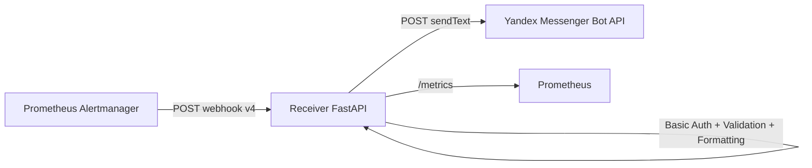
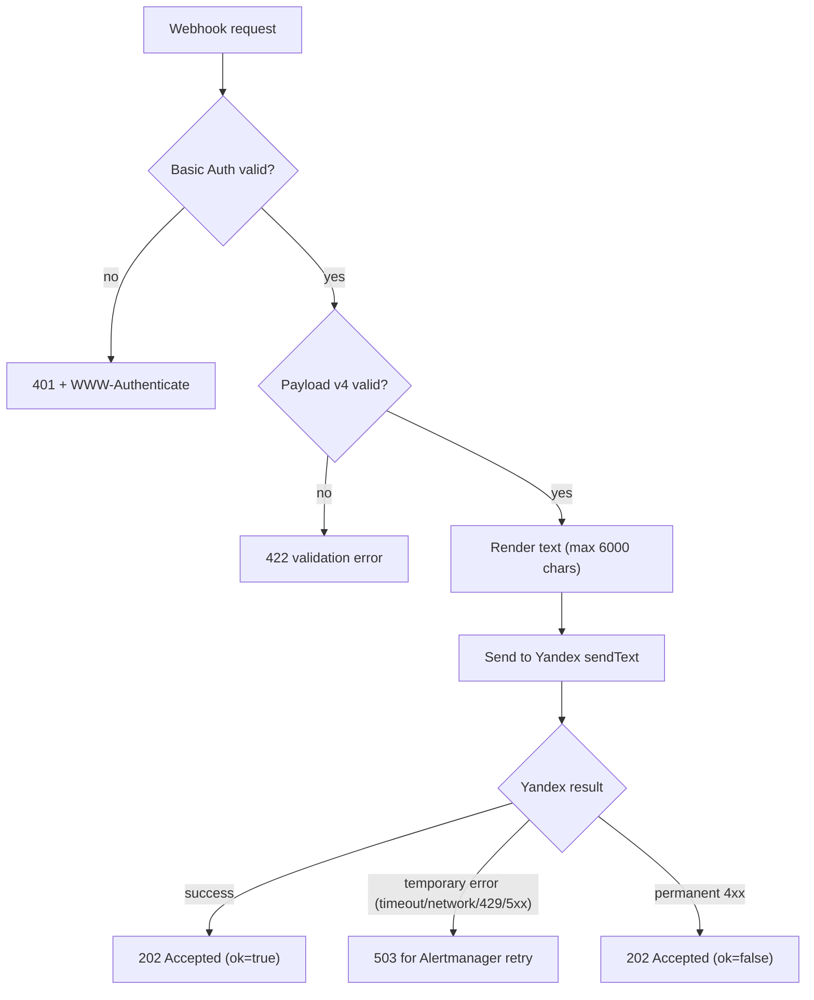
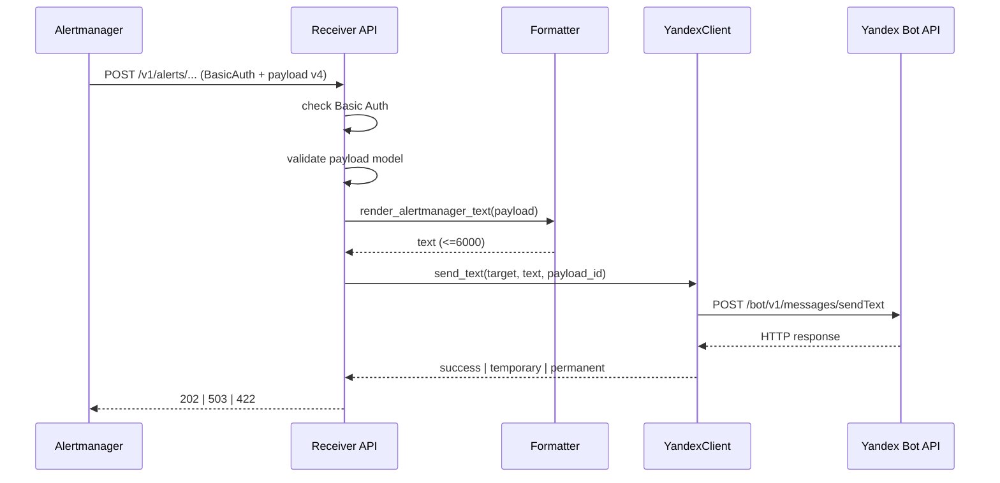
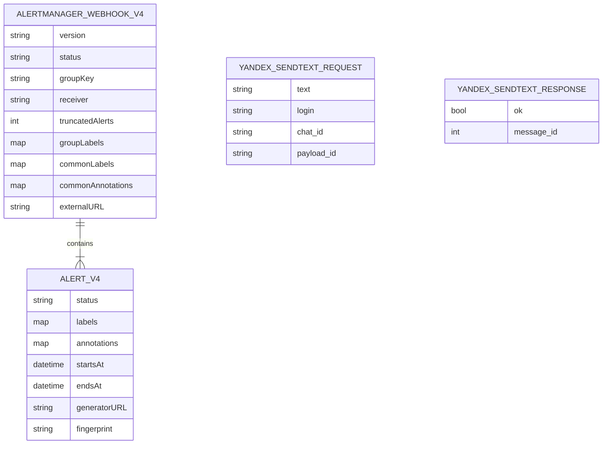

# ADR: Alertmanager -> Yandex Messenger Receiver

## 1. Бизнес-контекст

### Бизнес-задача
- Обеспечить стабильную доставку алертов из Prometheus Alertmanager в Yandex Messenger.
- Гарантировать предсказуемое поведение при ошибках за счет корректной семантики кодов ответа для ретраев Alertmanager.
- Зафиксировать единый и актуальный источник знаний по сервису `receiver`.

### Заказчик/стейкхолдер
- Инициатор: команда эксплуатации.
- Основные потребители: дежурные инженеры, SRE, разработчики сервисов, подключенных к Alertmanager.

### Customer Journey (оператор/дежурный)
1. Alertmanager формирует webhook payload v4 по событию `firing` или `resolved`.
2. Alertmanager вызывает `receiver` по endpoint для пользователя или чата.
3. `receiver` валидирует Basic Auth и структуру payload.
4. `receiver` форматирует сообщение и отправляет его в Yandex Bot API.
5. При временной ошибке `receiver` возвращает `503`, Alertmanager выполняет retry.
6. При успехе (или permanent 4xx, если configured ignore) `receiver` возвращает `202`.

---

## 2. Границы и scope

### Включено
- Только runtime-сервис `receiver` (`app/*`).
- Вход: Alertmanager webhook v4.
- Выход: Yandex Messenger Bot API `sendText`.
- `receiver` реализует только механизм доставки уведомления и маппинг ошибок/кодов ответа.
- Вся доменная логика формирования набора алертов (grouping, filtering, silencing, routing) остается на стороне Alertmanager.

---

## 3. High-level архитектура

Ключевые компоненты `receiver`:
- `app/api/v1/alerts.py` - входные endpoint'ы `/v1/alerts/users/{login}` и `/v1/alerts/chats/{chat_id}`.
- `app/auth/basic.py` - inbound Basic Auth с `WWW-Authenticate`.
- `app/models/alertmanager.py` - строгие типизированные модели payload v4 (`extra=allow` для forward compatibility).
- `app/services/formatters.py` - детерминированный рендер текста + truncation до 6000 символов.
- `app/services/yandex_client.py` - outbound HTTP-клиент к `sendText`, классификация temporary/permanent ошибок.
- `app/metrics.py` - prometheus-метрики.

---

## 4. Принцип работы (to-be / фактическая реализация)

### Поведение endpoint'ов
- `POST /v1/alerts/users/{login}` -> outbound `sendText` с `login`.
- `POST /v1/alerts/chats/{chat_id}` -> outbound `sendText` с `chat_id`.
- На успешную обработку возвращается `202` и JSON `{ "ok": bool, "yandex_message_id": int | null }`.
- Сервис не принимает решений о группировке/фильтрации/подавлении уведомлений; он обрабатывает payload, уже подготовленный Alertmanager.

### Retry-контракт
- `2xx` на входе = Alertmanager считает отправку успешной.
- `503` на входе = временная ошибка, Alertmanager повторяет доставку.
- Permanent `4xx` от Yandex не ретраится: политика единая для всех окружений, сервис возвращает `202` и фиксирует ошибку в логах/метриках.

Пояснение по `202` для permanent `4xx`:
- Возврат `202` в данном случае означает "запрос обработан, повторная доставка тем же payload не требуется".
- Permanent `4xx` (например, бот не участник чата, ограничения приватности) не устраняется ретраями и относится к классу конфигурационных/политических ошибок назначения.
- Возврат `5xx` для таких кейсов привел бы к бесполезным ретраям Alertmanager и росту retry-нагрузки без шанса на успешную доставку.
- Поэтому сигнализация по этим ошибкам ведется через метрики и логи (включая `payload_id`), а remediation выполняется операционно.

---

## 5. Sequence-диаграмма

---

## 6. ER-диаграмма (логическая модель данных)

Сервис stateless, постоянного хранилища нет. Ниже логические сущности входного/выходного контракта.

Бизнес-правило:
- В `YANDEX_SENDTEXT_REQUEST` должен быть указан ровно один target: `login` xor `chat_id`.

---

## 7. API и контракты

### Inbound API (`receiver`)
- `POST /v1/alerts/users/{login}`
- `POST /v1/alerts/chats/{chat_id}`
- Auth: HTTP Basic (`BASIC_AUTH_USERNAME`, `BASIC_AUTH_PASSWORD`).
- Body: Alertmanager webhook payload version `4`.

### Outbound API (Yandex)
- `POST {YANDEX_API_BASE}/bot/v1/messages/sendText`
- Header: `Authorization: OAuth <YANDEX_OAUTH_TOKEN>`
- Body: `text`, target (`login` или `chat_id`), `payload_id`.

### Идемпотентность
- `payload_id` формируется детерминированно из `target_kind`, `target_value`, итогового `text` и канонизированного JSON payload (с сортировкой ключей).
- Повтор идентичного сообщения для того же target приводит к идентичному `payload_id`.
- Изменение текста, target или содержимого payload приводит к новому `payload_id`.

---

## 8. Эксплуатация, нагрузка, мониторинг

### Конфигурация (env)
- Обязательные: `BASIC_AUTH_USERNAME`, `BASIC_AUTH_PASSWORD`, `YANDEX_OAUTH_TOKEN`.
- Опциональные: `BASIC_AUTH_REALM`, `YANDEX_API_BASE`, `YANDEX_HTTP_TIMEOUT_SECONDS`, `FAIL_ON_YANDEX_4XX`, шаблоны сообщения и параметры логирования.

### Наблюдаемость
- Healthcheck: `GET /healthz`.
- Метрики: `GET /metrics`.
- Основные счетчики:
  - `receiver_webhook_requests_total`
  - `receiver_webhook_alerts_total`
  - `receiver_yandex_send_total`
  - `receiver_yandex_send_latency_seconds`
  - `receiver_render_failures_total`

### Масштабирование
- Сервис stateless; горизонтально масштабируется через реплики.
- Узкое место при росте нагрузки: outbound канал в Yandex API и его rate limiting (`429`).
- При `503` retry-нагрузка переносится в Alertmanager backoff-механику.

Стратегия защиты от retry storm при `429/5xx`:
- Alertmanager остается единственной точкой ретраев (внутренние ретраи в receiver не используются).
- Receiver ограничивает давление на upstream через лимит числа воркеров/реплик и операционный контроль пикового RPS.
- При устойчивом росте `429` включается backpressure: допускается деградация через `503` в рамках согласованных SLO, без перехода к бесконтрольным внутренним retry.
- Обязательный операционный триггер: при превышении порога `503`/`429` команда эксплуатации снижает входной поток (route tuning/grouping в Alertmanager) до возврата в baseline.

### Нагрузочные целевые показатели (для текущей версии)
- Контекст: один экземпляр `receiver` обслуживает несколько receiver-конфигураций в Alertmanager (разные маршруты/чаты), поэтому нагрузка суммируется на одном ingress.
- Baseline (sustained): `50 RPS` в течение 30 минут без деградации по SLO.
- Peak burst: `120 RPS` в течение 5 минут с контролируемой деградацией (рост `503` допустим в пределах порога).
- Soak: `20-30 RPS` в течение 4-8 часов для проверки стабильности.

Целевые SLO/SLI:
- Inbound success rate (`2xx`): `>=99.5%` на окне 15 минут (исключая осознанные permanent-ошибки доставки).
- Inbound latency: `p50 <120ms`, `p95 <400ms`, `p99 <900ms`.
- Доля ответов `503`: `<1%` в baseline; в peak допускается до `3-5%`.
- `delivery_gap` (принято сервисом, но не доставлено): целевой `0`, допустимо кратковременно `<0.1%`.

Формула `delivery_gap` (аудируемая):
- `accepted_total` = число входящих запросов, завершившихся `202`.
- `delivered_total` = число исходящих отправок в Yandex со статусом outcome=`success` (метрика `receiver_yandex_send_total{outcome="success"}`).
- `delivery_gap = max(0, accepted_total - delivered_total) / accepted_total * 100%` на фиксированном 15-минутном окне.
- Для корректности сравнения используются только окна со стабильной монотонностью метрик и одинаковым scope по target (`user/chat`).

SLA/SLO (зафиксировано для заказчика):
- Заказчик: команда эксплуатации.
- SLA доступности сервиса (30-дневное окно): `99.9%`.
- SLO доступности API (`/v1/alerts/*`): `99.95%`.
- SLO по ошибкам доставки: `503 <1%` в baseline, `<=5%` в peak.
- SLO по задержкам: `p50 <120ms`, `p95 <400ms`, `p99 <900ms`.
- SLO по корректности доставки: `delivery_gap <=0.1%` (цель `0`).

Правило расчета SLI доступности API:
- В error budget доступности входят только ответы `5xx` на `/v1/alerts/*`.
- Ответы `4xx` (например, `401/422`) учитываются как client/business errors и не считаются недоступностью сервиса.

Критерий адекватности:
- Решение считается адекватным для production-старта при выполнении baseline + peak без лавинообразного роста ретраев Alertmanager и без устойчивой деградации latency.

---

## 9. Ограничения и особенности

1. Нет собственной очереди/outbox: доставка синхронная в рамках HTTP-запроса.
2. Нет персистентного хранения отправок/дедупа внутри сервиса.
3. `payload_id` рассчитывается на основе канонизированного payload + target + итогового текста; при больших payload это добавляет небольшой CPU-overhead на сериализацию/хэширование.
4. Политика permanent `4xx` единая для всех окружений (глобальная): сервис возвращает `202` (без ретраев в Alertmanager), событие фиксируется в логах и метриках.
5. Ошибка шаблона сообщения не роняет запрос: используется fallback-формат.
6. Шаблонизация сообщения на стороне Alertmanager для `webhook_config` не используется: для webhook receiver это не предусмотрено как механизм message templating, и advanced-паттерны в этом контуре сознательно не применяются на текущем этапе ([Prometheus docs: webhook_config](https://prometheus.io/docs/alerting/latest/configuration/#webhook_config)).
7. Аудит отправок без БД: используется только агрегат в метриках по неуспешным отправкам и поиск конкретной доставки по `payload_id` в логах.

---

## 10. Принятое решение / Рассмотренные альтернативы / Последствия

Принятое решение:
- Receiver выполняет только доставку и классификацию ошибок; grouping/filtering/silencing остаются в Alertmanager.
- Политика permanent `4xx` глобальная: всегда `202` на входе, без ретраев Alertmanager.
- Аудит без персистентного хранилища: метрики + поиск по `payload_id` в логах.

Рассмотренные альтернативы:
- Возврат `422` при permanent `4xx` в части окружений (per-env) — отклонено ради единообразия поведения.
- Персистентный аудит в БД — отклонено как избыточный scope для текущего этапа.
- Внутренние ретраи в receiver — отклонено, чтобы не усилить retry storm и не дублировать backoff Alertmanager.

Последствия:
- Поведение сервиса единообразно между окружениями и проще в эксплуатации.
- Для расследований используется log/metrics-based аудит; нет исторического журнала в БД.
- При пиках основная защита строится на route tuning и контроле входного потока в Alertmanager.
